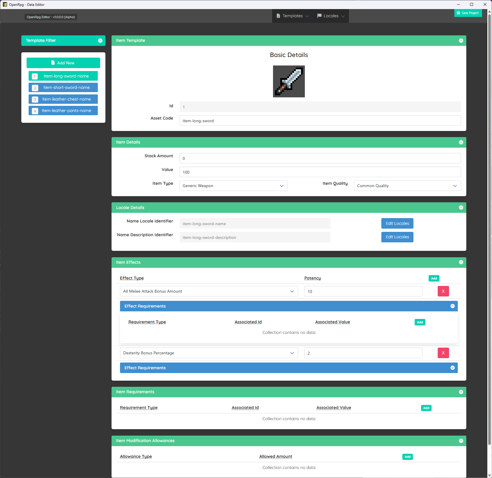

# Templates & Data

This may be a bit long winded but lets cover a few different high level concepts then get into the weeds.

To start off with as mentioned in the root readme there are two main sources of data in this system, so lets cover them.

## Static & Runtime Data

- Templates (Static Data)
- TemplateData (Runtime Data)

They both serve different purposes but are combined to make a top level data model, but let's quickly go over what we mean by static and runtime data before we jump back into how template and data combine specifically.

### What is Static Data?

Static data is data that is created ahead of time as part of your game content and lives with your other assets. For example if you were wanting to create an `Item` in your game you would need to express certain information ahead of time like.

- The items name/description
- What sort of item is it?
- Does it have any `Requirements`?
- Does it have any `Effects`?
- Does it allow any `Modifications`?
- Can it be stacked?
- What is its base value/price?

> For more information on `Requirements`, `Effects`, `Modifications` see [Common Objects Docs](/core.md)

This information can all be created ahead of time and doesn't change (hence it being static). So much like other game data/assets like textures, models etc this data should live within the project in whatever format you want (i.e json files, database).

> For example once you have created a `Longsword` item, its not going to change, its always going to be called a `Long Sword` its always going to have `5 Damage` and require `>= 1 Strength` to use, and maybe it has `1 Gem Modification Slot`. 

### What is Runtime Data?

Runtime data is created during the game/app is running and represents instances of static data, using the previous example of `Items` the runtime data associated for this would store things like:

- What is the `TemplateId` this relates to?
- How many of these items am I holding?
- Does it have any `Modifications` applied?

As you can see this is related to the static data but its more related to the instance of the static/template data.

> Using the `Longsword` example above you can easily be carrying 3 different **instances** of a `Longsword`, maybe you put a `Power Gem` into one of them that you equipped and 2 unmodified ones are in your inventory.

So as your game/app is run and the player/user picks up weapons we would want to save the runtime data on the users computer within a save file of some kind, but there is no point saving the static data it relates to as that is already part of the game data.

## Applying this to `Templates` and `TemplateData`

Now we know the difference between static and runtime data and how they are both important lets go back to discussing `Templates`.

In most RPG scenarios you will need to express notions like:
- `Races` (i.e Human, Orcs, Elves etc)
- `Classes` (i.e Fighter, Rogue, Wizard etc)
- `Items` (i.e Longsword, Health Potion, Some Quest Item etc)
- `Quests`

So with that in mind lets look at the editor briefly, which is a free optional tool you can use to handle your static `Template` data.

 

As you can see this gives us a simple way to express all our templates so we can build up a whole database of our game data which only needs to be loaded once in memory and it doesn't matter if you have 1 or 100 `Longswords`, the `ItemTemplate` for it will always be the same, and always have the `Id` of `1` (well in this example anyway).

> Again you are free to manage your `Templates` however you wish, create them all however you wish, even directly in code if thats what works for you. This tool just provides a simple way to visually see the data that makes up a typical `Template`.

Now we know what `Templates` are lets rewind back to `TemplateData` which would allow us to track instances of `Templates` within the game, be it in someone's inventory, on the floor somewhere, equipped on someone's head etc.

As mentioned both parts are needed for the system to function, as taking the `Longsword` example from before, if we want to attack someone with it once equipped we would need to work out how much damage it does.

> Let's assume it has a base `10 Damage` from the `Template` but this instance has been modded with a `Power Gem` which for arguments sake lets say gives you `10% Damage Bonus`, which would mean **OUR** longsword does `11 Total Damage`, but we wouldn't know this without both parts of the puzzle.

To make things simpler we try to combine both parts into a model for ease of use within the framework but under the hood both halves come from different places.

## Combining the data

Keeping our focus on `Items` we have an `ITemplateInstance` interface (and `TemplateInstance` class) that encapsulates the notion of combining both these separate parts for a single complete perspective of your instance of a template, using `Items` as an example we can see in the source there are 3 classes representing these parts:
- `ItemTemplate` (Contains static data describing an Item)
- `ItemData` (Contains runtime data describing the INSTANCE of the item)
- `Item` (contains both `ItemTemplate` and `ItemData` as `Template` and `Data` properties)

This way when you are wanting to calculate damage, or various other things within the system that need both the template and instance data you can provide this single object which simplifies things, then when the time comes to save the players progress you only need to save the `ItemData` information.

## Extending Templates

We have only covered the basic use cases and data `Templates` and `TemplateData` can store, the whole framework is meant to be extensible by layering conventions on top of the basic objects via extension methods.

Due to each `Template` and `TemplateData` having their own internal `Variables` object (a fancy `Dictionary`) you can apply whatever you want into there, for example maybe in your games items dont take up slots/stacks but instead have weight, so you could only want to store weight data, or maybe your item instance allows for enchantments or maybe in advanced scenarios you are procedurally generating your items based off `ProceduralTemplates`.

> You can find out more about this sort of thing by looking at the `OpenRpg.Genres.*` projects which provide pre-made conventions and shows how to add custom data/notions.